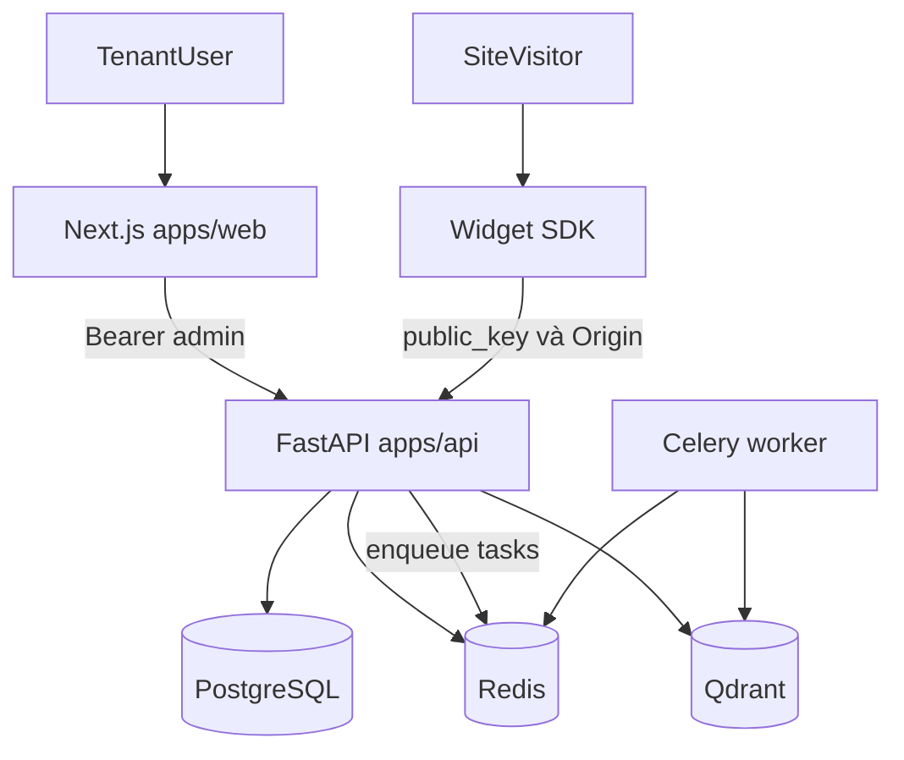

# context.md — Bối cảnh nhanh (Widget Chatbot)

> File này giúp **định hướng trong vài phút**: sản phẩm là gì, monorepo gồm những gì, luồng chạy chính, và nên đọc tiếp tài liệu nào. **Không** thay thế runbook production hay bảng API đầy đủ — xem các liên kết ở cuối.

**Widget Chatbot** là nền tảng SaaS **multi-tenant**: khách hàng nhúng chatbot vào website bằng snippet JavaScript; bot trả lời dựa trên **RAG** (tài liệu đã upload) và/hoặc **Text-to-SQL** (truy vấn read-only tới database do tenant cấu hình).

---

## Bản đồ monorepo

| Thư mục | Vai trò |
| -------- | ------- |
| `apps/api/` | Backend REST: auth, admin, chat, webhooks, files — FastAPI, SQLAlchemy, Celery tasks |
| `apps/web/` | Dashboard Next.js 14 (App Router), Tailwind |
| `apps/widget-sdk/` | Script nhúng nhẹ (Vite IIFE) |
| `packages/types/` | Kiểu TypeScript dùng chung |
| `docs/` | Thiết kế, runbook; tiến độ chi tiết có thể xem thêm [docs/PROGRESS.md](docs/PROGRESS.md) |
| `tasks/` | Checklist theo phase / billing |

---

## Luồng runtime (tóm tắt)



- **Dashboard:** đăng nhập tenant → Bearer token → các route `/api/v1/admin/...` (và files upload).
- **Widget:** trình duyệt khách → SDK gửi `public_key`, server kiểm tra **Origin** với whitelist của tenant → `/api/v1/chat/...`.
- **Dữ liệu:** PostgreSQL cho tenant/chat/billing metadata; Redis cho cache/broker Celery; Qdrant cho vector RAG. Chi tiết kiến trúc dữ liệu: [PROGRESS.md](PROGRESS.md).

---

## Bảo mật (bullet tóm tắt)

- Hai loại thông tin xác thực: **public key** (widget) và **admin** (Bearer sau login); khóa lưu trong `tenant_keys`.
- Mọi request từ widget: kiểm tra **`Origin`** với danh sách domain cho phép.
- Cấu hình DB tenant: mã hóa (AES-256-GCM), khóa ứng dụng qua biến môi trường (xem nhóm env bên dưới).
- SQL agent: chỉ **SELECT**, luôn cô lập theo **tenant**.

Chi tiết và quy tắc làm việc (kể cả cho AI agent): [AGENTS.md](AGENTS.md).

---

## Trạng thái và lộ trình

Số phase và trạng thái **cập nhật theo** [PROGRESS.md](PROGRESS.md) (ví dụ Phase 7 Billing/Commercial). Việc đang làm theo ngày: [task.md](task.md) và các file trong `tasks/` (`task_phase_*.md`, `task_billing_*.md`).

---

## Tài liệu nên đọc tiếp (thứ tự gợi ý)

1. [AGENTS.md](AGENTS.md) — lệnh chuẩn, pytest, Alembic, **bảng endpoint**, quy tắc agent, model DB tóm tắt.
2. [README.md](README.md) — cài đặt dev nhanh, Docker Redis, Celery, iframe/widget.
3. [docs/PRODUCTION_RUNBOOK.md](docs/PRODUCTION_RUNBOOK.md) — vận hành production.
4. [tasks/task_billing_plans.md](tasks/task_billing_plans.md) — định nghĩa gói & mapping `tenant.plan`.
5. [tasks/task_billing_commercial.md](tasks/task_billing_commercial.md) — backlog billing/commercial.

---

## Biến môi trường (chỉ nhóm — không commit secret)

Cấu hình thực tế nằm trong `apps/api/.env` (và biến frontend `apps/web`); **không** commit file `.env`.

| Nhóm | Gợi ý nội dung |
| ---- | -------------- |
| Database | URL/ host / user / password PostgreSQL |
| Redis | URL broker + cache |
| Mã hóa | `APP_ENCRYPTION_KEY` (credentials DB tenant) |
| AI / embedding | Model Gemini/OpenAI, Qdrant URL/API key — **không** đổi tùy tiện các biến dim/model đã chốt (xem AGENTS) |
| PayOS | Biến cấu hình checkout/webhook (khi bật billing) |
| Frontend `NEXT_PUBLIC_*` | URL API, email sales/support hiển thị CTA |

---

## Lệnh tối thiểu (Windows / repo này)

Chạy Python trong venv của API (không dùng system Python):

```powershell
cd apps/api
.\.venv\Scripts\python.exe -m uvicorn main:app --reload --port 8001
```

```powershell
cd apps/api
.\.venv\Scripts\python.exe -m pytest tests/ -v
```

```powershell
cd apps/api
.\.venv\Scripts\alembic.exe upgrade head
```

Frontend (khi sửa `apps/web`):

```powershell
cd apps/web
npm run dev
```

Worker Celery và Redis: xem hướng dẫn đầy đủ trong [README.md](README.md).
